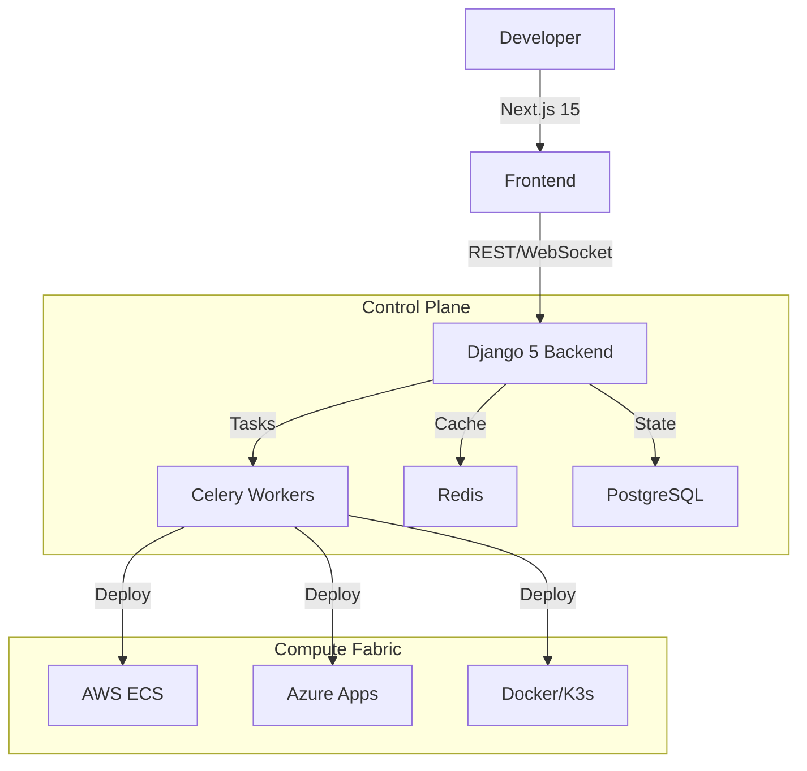

# SMSLY Hosting v2 - The Hyperscale PaaS

[](LICENSE)
[](frontend/)
[](backend/)
[](https://codespaces.new/SMSLYCLOUD/smsly-hosting)

**The Universal PaaS for Hyperscale Infrastructure.**

SMSLY Hosting v2 is a complete rewrite of the hosting platform, designed to be the "Control Plane for the Internet". It unifies AWS, Azure, GCP, Railway, and Local/K3s deployments into a single, beautiful dashboard with AI-driven observability.

---

## ⚡ Quick Start

### Option 1: GitHub Codespaces (Recommended)

Click the button above or:

```bash
# Opens in browser with everything pre-configured
gh codespace create -r SMSLYCLOUD/smsly-hosting
```

### Option 2: Local Development

```bash
git clone https://github.com/SMSLYCLOUD/smsly-hosting.git
cd smsly-hosting
bash quick-start.sh
```

### Option 3: Production Install (Ubuntu 22.04+)

```bash
curl -fsSL https://raw.githubusercontent.com/SMSLYCLOUD/smsly-hosting/main/install-v2.sh | sudo bash
```

---

## 🚀 Running the Platform

After setup, start the services in separate terminals:

```bash
# Terminal 1: Backend API
cd backend
gunicorn config.wsgi:application --bind 0.0.0.0:8000 --workers 4

# Terminal 2: Frontend
cd frontend
npm run dev

# Terminal 3: Celery Worker (optional)
cd backend
celery -A config worker -l INFO
```

---

## 🌐 Access Points

| Service | URL | Description |
|---------|-----|-------------|
| **Frontend** | `http://localhost:3000` | Main dashboard |
| **API** | `http://localhost:8000/api/` | REST API |
| **Swagger** | `http://localhost:8000/api/schema/swagger/` | API documentation |
| **Admin** | `http://localhost:8000/admin/` | Django admin panel |

> **Codespaces:** Use the Ports tab to access forwarded URLs.

**Default Credentials:** `admin` / `admin123`

---

## ✨ Key Features

### 🌍 Multi-Cloud Orchestration

- **AWS:** ECS Fargate, Lambda, RDS, S3
- **Azure:** Container Apps, Functions, SQL
- **GCP:** Cloud Run, Cloud SQL, BigQuery
- **Railway/Vercel:** Zero-config deploys
- **Local:** Docker/K3s clusters

### 🧠 AI Intelligence Engine

- Predictive failure analysis
- Auto-remediation suggestions
- Cost optimization advisor

### 🛡️ Enterprise Security

- Zero-trust architecture
- Fernet field encryption
- Merkle-tree audit logs
- HMAC-signed inter-service auth

### 🚀 Developer Experience

- Visual project canvas
- Web terminal (SSH in browser)
- Real-time log streaming
- One-click marketplace deploys

---

## 🏗️ Architecture



---

## 📦 Tech Stack

| Layer | Technology |
|-------|------------|
| Frontend | Next.js 15, React 19, Tailwind, Shadcn UI |
| Backend | Django 5.0, Channels, Celery |
| Database | PostgreSQL 16 |
| Cache | Redis |
| Infra | Docker Compose, K3s |

---

## 🔧 Environment Variables

Key environment variables (auto-generated by `setup.sh`):

| Variable | Description |
|----------|-------------|
| `SECRET_KEY` | Django secret key |
| `FIELD_ENCRYPTION_KEY` | Fernet key for field encryption |
| `DATABASE_URL` | PostgreSQL connection string |
| `REDIS_URL` | Redis connection string |
| `ALLOWED_HOSTS` | Comma-separated hostnames |

---

## 🤝 Contributing

1. Fork the repo
2. Create feature branch (`git checkout -b feature/amazing`)
3. Commit changes
4. Push and open PR

---

## 📄 License

MIT License. See [LICENSE](LICENSE) for details.
