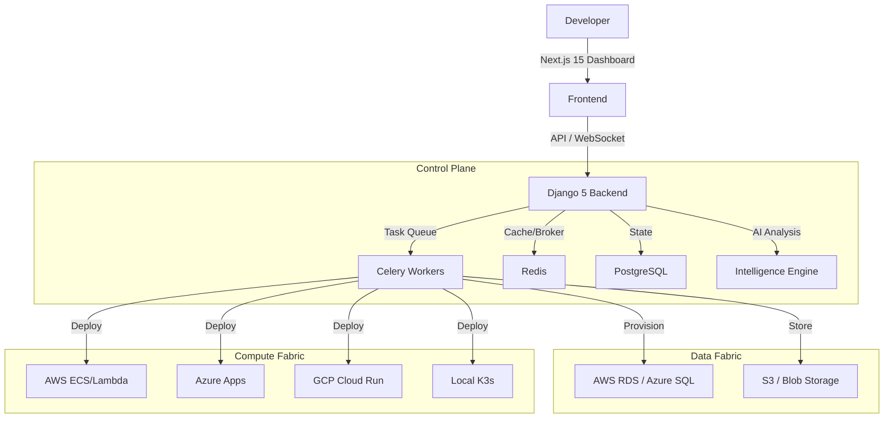

# SMSLY Hosting v2 - The Hyperscale PaaS

[](LICENSE)
[](frontend/)
[](backend/)

**The Universal PaaS for Hyperscale Infrastructure.**

SMSLY Hosting v2 is a complete rewrite of the hosting platform, designed to be the "Control Plane for the Internet". It unifies AWS, Azure, GCP, Railway, and Local/K3s deployments into a single, beautiful dashboard with AI-driven observability.

---

## ⚡ Quick Install

```bash
curl -fsSL https://get.smsly.cloud/v2/install | sudo bash
```

Or clone and run:

```bash
git clone https://github.com/SMSLYCLOUD/smsly-hosting.git
cd smsly-hosting
sudo ./install-v2.sh
```

---

## ✨ Key Features (v2)

### 🌍 Multi-Cloud Orchestration (Universal Adapter)
Manage resources across all major providers from one UI:
- **AWS:** ECS Fargate, Lambda, RDS, S3, IAM, WAF.
- **Azure:** Container Apps, Functions, SQL, Blob Storage, Entra ID.
- **GCP:** Cloud Run, Functions, Cloud SQL, BigQuery.
- **Railway/Vercel:** Direct API integration for zero-config deploys.
- **Local:** Self-hosted Docker/K3s clusters.

### 🧠 Intelligence Engine
- **Predictive Failure Analysis:** AI detects OOM kills and crash loops before they escalate.
- **Auto-Remediation:** "One-click fix" suggestions (e.g., "Scale memory to 1GB").
- **Cost Advisor:** Real-time comparison of AWS vs GCP vs Railway pricing.

### 🛡️ Enterprise Security (Zero Trust)
- **Device Binding:** Access restricted by `X-Device-Fingerprint`.
- **Audit Trail:** Merkle-tree backed immutable logs.
- **Secrets Management:** Fernet/KMS encryption for environment variables.
- **WAF & DDoS Shield:** Integrated protection rules.

### 🚀 Developer Experience
- **Project Canvas:** Visual graph view of your architecture.
- **Web Terminal:** SSH into any container directly from the browser.
- **Real-time Logs:** WebSocket-based live streaming.
- **Previews:** Automatic ephemeral environments for every PR.

---

## 🏗️ Architecture



---

## 📦 Stack

- **Frontend:** Next.js 15 (App Router), React 19, Tailwind CSS, Shadcn UI.
- **Backend:** Django 5.0 (Async), Django Channels, Celery, Redis.
- **Database:** PostgreSQL 16.
- **Infrastructure:** Docker Compose (Local), K3s (Production).

---

## 🤝 Contributing

We welcome contributions! Please read `CONTRIBUTING.md` for details.

1. Fork the repo.
2. Create your feature branch (`git checkout -b feature/amazing-feature`).
3. Commit your changes.
4. Push to the branch.
5. Open a Pull Request.

---

## 📄 License

MIT License. See [LICENSE](LICENSE) for details.
