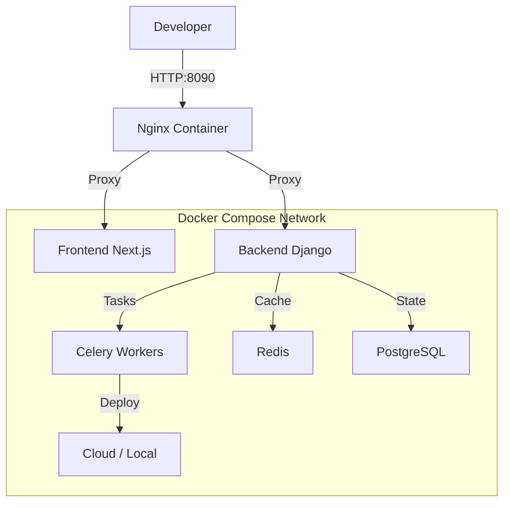

# SMSLY Hosting v2 - The Hyperscale PaaS

[](LICENSE)
[](frontend/)
[](backend/)

**The Universal PaaS for Hyperscale Infrastructure.**

SMSLY Hosting v2 is designed to be the "Control Plane for the Internet". It unifies AWS, Azure, GCP, Railway, and Local deployments into a single, beautiful dashboard with AI-driven observability.

---

## ⚡ Quick Start (Production)

**WARNING:** The installation script is aggressive. It is designed for a **FRESH VPS** (Ubuntu 22.04+ recommended). It will remove existing Docker, Nginx, and Apache installations to ensure a clean slate.

### One-Line Install

```bash
curl -fsSL https://raw.githubusercontent.com/SMSLYCLOUD/smsly-hosting/main/install.sh | sudo bash
```

**What this does:**
1.  Cleans up conflicting services (Apache, Nginx, old Docker).
2.  Installs Docker Engine & Compose.
3.  Generates secure credentials (`.env`).
4.  Deploys the full stack on port **8090**.

### Requirements
*   **RAM:** 2GB+ (4GB recommended)
*   **CPU:** 2 vCPU+
*   **OS:** Ubuntu 22.04 / 24.04 (Fresh Install)

---

## 🌐 Access Points

After installation, access your dashboard:

| Service | URL | Default Credentials |
|---------|-----|---------------------|
| **Dashboard** | `http://<YOUR_IP>:8090` | `admin` / `admin` |
| **Admin Panel** | `http://<YOUR_IP>:8090/admin` | `admin` / `admin` |
| **API** | `http://<YOUR_IP>:8090/api/v1/` | - |

> **Note:** The default installation does not configure SSL/HTTPS. It is recommended to put this server behind a secure proxy (like Cloudflare) or configure Nginx/Traefik manually for SSL if exposing to the public internet.

---

## 🏗️ Architecture



---

## 📦 Tech Stack

| Layer | Technology |
|-------|------------|
| Frontend | Next.js 15, React 19, Tailwind, Shadcn UI |
| Backend | Django 5.0, Channels, Celery |
| Database | PostgreSQL 16 |
| Cache | Redis 7 |
| Infra | Docker Compose |

---

## 🔧 Environment Variables

The installer automatically generates a `.env` file at `/opt/smsly-hosting/.env`.

Key variables:
- `SECRET_KEY`: Django secret.
- `FIELD_ENCRYPTION_KEY`: For encrypting sensitive user data (API keys).
- `DATABASE_URL`: Connection to internal Postgres.
- `ALLOWED_HOSTS`: Comma-separated list of allowed domains/IPs.

---

## 🤝 Contributing

1. Fork the repo
2. Create feature branch (`git checkout -b feature/amazing`)
3. Commit changes
4. Push and open PR

---

## 📄 License

MIT License. See [LICENSE](LICENSE) for details.
