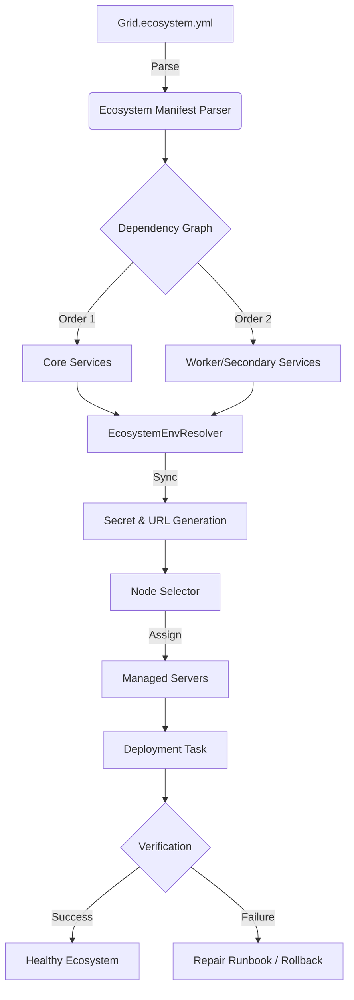

# Ecosystem Deployment Architecture

This document provides a high-level overview of the Grid ecosystem deployment orchestration flow.

## Deployment Flow Overview

The following diagram illustrates the lifecycle of an ecosystem deployment, from manifest parsing to service verification.

## Key Documentation

For detailed information on specific components, refer to the following guides:

- **Orchestration & Logic**: [ECOSYSTEM_DEPLOY_ORCHESTRATION_AUDIT.md](file:///c:/Users/osaretin/Documents/SMSLY/SMSLY_CORE/smsly-hosting/docs/ECOSYSTEM_DEPLOY_ORCHESTRATION_AUDIT.md)
- **Intelligence Layer**: [ECOSYSTEM_DEPLOYMENT_INTELLIGENCE.md](file:///c:/Users/osaretin/Documents/SMSLY/SMSLY_CORE/smsly-hosting/docs/ECOSYSTEM_DEPLOYMENT_INTELLIGENCE.md)
- **Manifest Schema**: [ECOSYSTEM_MANIFEST_SPEC.md](file:///c:/Users/osaretin/Documents/SMSLY/SMSLY_CORE/smsly-hosting/docs/ECOSYSTEM_MANIFEST_SPEC.md)
- **Troubleshooting**: [ECOSYSTEM_DEPLOY_REPAIR_RUNBOOK.md](file:///c:/Users/osaretin/Documents/SMSLY/SMSLY_CORE/smsly-hosting/docs/ECOSYSTEM_DEPLOY_REPAIR_RUNBOOK.md)

## Automation Scripts

The orchestration is supported by several key scripts:

- **Full Ecosystem Deploy**: [deploy_all.py](file:///c:/Users/osaretin/Documents/SMSLY/SMSLY_CORE/smsly-hosting/scripts/deploy_all.py)
- **Service Verification**: [validate_production.py](file:///c:/Users/osaretin/Documents/SMSLY/SMSLY_CORE/smsly-hosting/scripts/validate_production.py)
- **Health Guard**: [caddy-health-guard.sh](file:///c:/Users/osaretin/Documents/SMSLY/SMSLY_CORE/smsly-hosting/scripts/caddy-health-guard.sh)

---
*Version: 1.0.0*
*Last Updated: 2026-05-08*
