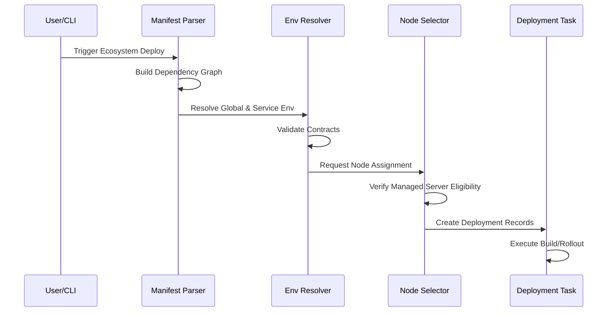

# Ecosystem Deploy Orchestration Audit

> [!NOTE]
> **Version**: 1.1.0
> **Last Updated**: 2026-05-08
> **Changelog**: 
> - v1.1.0: Added architectural diagram and version tracking.
> - v1.0.0: Initial audit of orchestration flow.

## Orchestration Overview

## The Core Problem
Grid's platform currently builds services individually and has an `ecosystem_deploy_task`, but it struggles with environment variable persistence and cross-service dependencies before actual deployment begins.

## Current Flow Issues
1. **Env Generation & Persistence**: The env generation (`_resolve_env_placeholders` and `_normalize_env_vars` in `tasks_ecosystem.py`) only happens just as the `Deployment` record is created, but it does not run strict validation against required ecosystem-level contracts or block on weak placeholders before attempting the build.
2. **Missing Env Guard**: Deployments do not consistently block when required external values are missing. Services may build/run, only to fail at runtime.
3. **Unassigned Nodes**: Services are created without verifying that a `ManagedServer` eligible for the workload is available. This can result in services being created in an unassigned or silently misassigned state, particularly if the primary/control-plane server is the only one available but shouldn't host user workloads.
4. **Vague Diagnostics**: If the ecosystem deploy fails due to node selection or missing env, the diagnostic is often generic or absent, making it difficult for the user to understand what happened without checking raw server logs.

## Needed Improvements
1. **Strict Production Environment Resolver**: Reject weak placeholders, block on missing required values, and sync shared environment groups across dependent services.
2. **Bulk Persistence**: Resolve and persist all env vars for the ecosystem *before* starting any builds.
3. **Strict Node Assignment**: Select and verify eligible nodes before creating service records, preventing "unassigned" deployments. Protect the control plane.
4. **Graph-based Orchestration**: Build a dependency graph first (via manifests) to orchestrate shared secrets, URLs, and correct deployment order.
